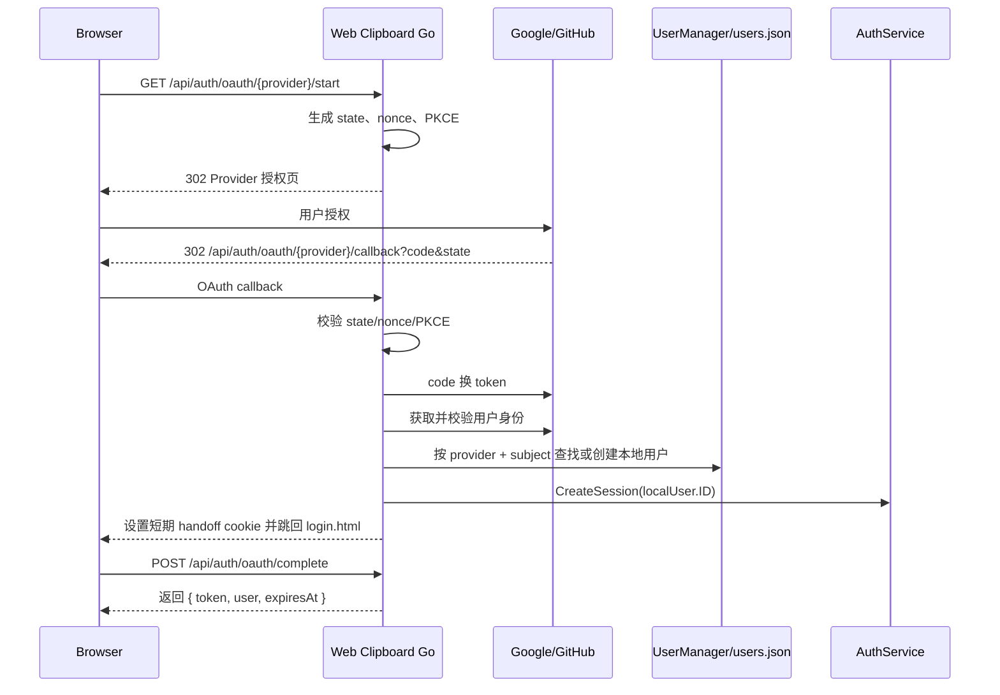

# Google/GitHub 统一登录接入方案

## 目标

为 Web Clipboard Go 增加 Google、GitHub 等第三方统一登录能力，同时保留当前应用内的用户、角色、会话和管理模型。

本方案的核心原则是：第三方身份只用于证明用户是谁；应用自己的访问控制仍由本地用户和本地 session 决定。

## 当前认证现状

当前项目已经有完整的本地认证闭环：

- `POST /api/auth/login` 使用用户名和密码登录。
- `POST /api/auth/logout` 删除当前 session。
- `GET /api/auth/me` 返回当前用户。
- 业务 API 统一经过 `AuthMiddleware` 校验本地 bearer token。
- 用户、角色、启停状态由 `UserManager` 管理，并持久化到 `data/users.json`。
- 前端 `Auth` 工具把 token、过期时间和当前用户保存到 `localStorage`。

因此，第三方登录不应该绕过现有 `AuthMiddleware`，而应该在 OAuth/OIDC 回调成功后映射成本地用户，再创建当前项目已有的 session。

## 推荐结论

建议引入协议级开源库，不建议从零手写 OAuth/OIDC，也不建议一开始引入大而全的认证框架。

推荐依赖：

- `golang.org/x/oauth2`
  - 负责 OAuth2 授权 URL、授权码交换、token client、PKCE/state 等流程。
- `github.com/coreos/go-oidc/v3/oidc`
  - 负责 Google 等 OIDC provider 的 discovery、ID token 验签、issuer/audience/expiry 校验。

暂不建议引入：

- `github.com/markbates/goth`
  - provider 覆盖广，但抽象较重。当前项目已有用户、角色、session 和管理模型，引入后容易与本地模型重叠。
- `github.com/google/go-github`
  - 仅为读取 GitHub `/user` 和 `/user/emails` 时不是必需。可先用 `net/http` 实现，后续如果需要大量 GitHub API 再引入。

## 总体架构



## 后端设计

### 新增模型

建议扩展 `User` 模型，保持旧 `users.json` 可兼容读取：

```go
type ExternalIdentity struct {
    Provider      string    `json:"provider"`
    Subject       string    `json:"subject"`
    Email         string    `json:"email"`
    EmailVerified bool      `json:"emailVerified"`
    Username      string    `json:"username"`
    DisplayName   string    `json:"displayName"`
    AvatarURL      string    `json:"avatarUrl"`
    LinkedAt      time.Time `json:"linkedAt"`
}

type User struct {
    ID         string             `json:"id"`
    Username   string             `json:"username"`
    Password   string             `json:"password,omitempty"`
    Email      string             `json:"email"`
    Role       string             `json:"role"`
    CreatedAt  time.Time          `json:"createdAt"`
    UpdatedAt  time.Time          `json:"updatedAt"`
    IsActive   bool               `json:"isActive"`
    Identities []ExternalIdentity `json:"identities,omitempty"`
}
```

账号绑定应以 `(provider, subject)` 为唯一键。

不要把 email 当成唯一身份键，原因是：

- Google 的稳定唯一标识是 `sub`。
- GitHub 的稳定唯一标识是用户 `id`。
- email 可能变更、隐藏、未验证或与已有本地账号冲突。

### 新增服务

建议新增 `backend/internal/services/oauth.go`：

```go
type OAuthService struct {
    providers map[string]OAuthProvider
    states    OAuthStateStore
    handoffs  OAuthHandoffStore
}

type OAuthProvider interface {
    Name() string
    AuthCodeURL(state string, opts OAuthStartOptions) string
    Exchange(ctx context.Context, code string, verifier string) (*ExternalIdentity, error)
}
```

`OAuthService` 负责：

- 判断 provider 是否启用。
- 创建 OAuth state、nonce、PKCE verifier。
- 校验 callback state。
- 调用 provider 换取身份。
- 生成短期登录 handoff。

`UserManager` 负责：

- `GetUserByExternalIdentity(provider, subject string)`
- `FindUserByVerifiedEmail(email string)`
- `CreateExternalUser(identity ExternalIdentity, role string)`
- `LinkExternalIdentity(userID string, identity ExternalIdentity)`

### 新增路由

```go
auth.GET("/providers", handler.ListAuthProviders)
auth.GET("/oauth/:provider/start", handler.StartOAuthLogin)
auth.GET("/oauth/:provider/callback", handler.HandleOAuthCallback)
auth.POST("/oauth/complete", handler.CompleteOAuthLogin)
```

建议 callback 不直接把应用 token 放到 URL 中。

推荐流程：

1. callback 成功后创建本地 session。
2. 后端生成一个一次性 `handoffCode`，保存 `session.Token/user/expiresAt`，有效期 1 分钟。
3. 后端通过 HttpOnly、SameSite=Lax cookie 写入 `oauth_handoff`。
4. 后端跳转到 `/login.html?oauth=complete`。
5. 前端调用 `POST /api/auth/oauth/complete`。
6. 后端读取并删除 `oauth_handoff`，返回现有 `LoginResponse`。
7. 前端复用当前 `Auth.setToken`、`setTokenExpiry`、`setCurrentUser`。

这样可以避免 token 出现在浏览器地址栏、代理日志或 Referer 中。

## Provider 实现

### Google

Google 使用 OIDC。

配置：

- scope: `openid email profile`
- redirect URI: `https://<host>/api/auth/oauth/google/callback`
- 必须校验：
  - `state`
  - `nonce`
  - ID token 签名
  - `issuer`
  - `audience`
  - `expiry`
  - `email_verified`

本地账号键：

```text
provider = "google"
subject = idToken.Subject
```

### GitHub

GitHub OAuth App 使用 OAuth2 web application flow。

配置：

- scope: `read:user user:email`
- redirect URI: `https://<host>/api/auth/oauth/github/callback`

回调后：

1. 使用 code 换取 GitHub access token。
2. 调用 `GET https://api.github.com/user` 获取 `id/login/name/avatar_url`。
3. 调用 `GET https://api.github.com/user/emails` 获取 primary 且 verified 的 email。
4. 如果没有 verified email，应拒绝自动注册，提示用户绑定公开且已验证邮箱。

本地账号键：

```text
provider = "github"
subject = strconv.FormatInt(githubUser.ID, 10)
```

## 账号策略

建议默认策略：

- 如果 `(provider, subject)` 已绑定本地用户：
  - 用户存在且启用：创建 session。
  - 用户不存在或停用：拒绝登录。
- 如果未绑定：
  - `OAUTH_AUTO_PROVISION=true` 时自动创建普通用户。
  - `OAUTH_AUTO_PROVISION=false` 时拒绝登录，由管理员预先创建或绑定。
- 自动创建用户默认角色必须是 `user`。
- 管理员身份仍由现有用户管理功能授予。
- 不允许第三方登录自动成为 admin。

email 冲突策略：

- 如果 provider 返回 verified email，且本地已有同 email 用户：
  - 默认不自动绑定，避免账号劫持风险。
  - 更安全的做法是要求已登录用户在账号设置页主动绑定。
- 如果是新用户自动注册：
  - username 可使用 `google:<email-local-part>` 或 `github:<login>`，冲突时追加短 ID。

## 配置设计

建议使用环境变量：

```text
APP_BASE_URL=https://clipboard.example.com

OAUTH_AUTO_PROVISION=false
OAUTH_ALLOWED_EMAIL_DOMAINS=example.com,example.org

GOOGLE_OAUTH_ENABLED=true
GOOGLE_OAUTH_CLIENT_ID=...
GOOGLE_OAUTH_CLIENT_SECRET=...

GITHUB_OAUTH_ENABLED=true
GITHUB_OAUTH_CLIENT_ID=...
GITHUB_OAUTH_CLIENT_SECRET=...
```

说明：

- `APP_BASE_URL` 用于生成 redirect URI，反向代理部署时必须配置为外部访问地址。
- secret 不应写入仓库、Dockerfile 或前端产物。
- `docker-compose.yml` 可保留示例变量名，但不要提交真实值。

## 前端设计

登录页增加第三方登录按钮：

- 使用现有 `lucide-react` 图标体系。
- 按 `GET /api/auth/providers` 动态显示启用的 provider。
- 点击后跳转到 `/api/auth/oauth/{provider}/start`。
- 页面加载时如果 URL 包含 `oauth=complete`，调用 `Auth.completeOAuthLogin()`。

`Auth` 新增方法：

```js
static async completeOAuthLogin() {
    const response = await fetch('/api/auth/oauth/complete', { method: 'POST' });
    if (!response.ok) {
        const error = await response.json().catch(() => ({ error: 'OAuth login failed' }));
        throw new Error(error.error || 'OAuth login failed');
    }
    const data = await response.json();
    this.setToken(data.token);
    this.setTokenExpiry(data.expiresAt);
    this.setCurrentUser(data.user);
    return data.user;
}
```

本阶段可以保留当前 `localStorage` token 机制，以降低改动面。

中期建议再迁移到 HttpOnly SameSite Cookie session，以降低 XSS 后 token 被读取的风险。

## 安全要求

必须实现：

- `state` 防 CSRF。
- Google OIDC `nonce` 防重放。
- PKCE，降低授权码泄露风险。
- callback 只接受已配置 provider。
- redirect URI 固定生成，不接受用户传入任意 redirect。
- 不把应用 session token 放入 URL。
- OAuth state 和 handoff 短期有效、一次性使用。
- 不持久化第三方 access token。
- 登录失败时日志记录 provider 和错误类型，但不记录 token、code、client secret。
- 自动注册时只授予 `user` 角色。
- 支持禁用用户后拒绝第三方登录，并清理其本地 session。

## 数据迁移

由于当前 `users.json` 是 JSON 文件，迁移可保持懒加载兼容：

- 旧用户没有 `identities` 字段时按空数组处理。
- 旧用户继续支持用户名密码登录。
- 第三方登录创建的新用户可以 `Password` 为空。
- `ValidateCredentials` 需要在 `Password` 为空时直接拒绝本地密码登录。

建议增加单元测试覆盖：

- 旧 `users.json` 可正常读取。
- 空密码用户不能走本地密码登录。
- 同一 provider subject 不会重复创建用户。
- 停用用户无法通过 OAuth 登录。
- 最后一个 admin 保护逻辑不受影响。

## 实施步骤

1. 增加 OAuth 配置读取和 provider 启用列表。
2. 引入 `golang.org/x/oauth2` 和 `github.com/coreos/go-oidc/v3/oidc`。
3. 增加 `ExternalIdentity` 模型和 `UserManager` 查找/创建/绑定方法。
4. 增加 `OAuthService`，实现 state、PKCE、handoff 存储。
5. 实现 Google provider。
6. 实现 GitHub provider。
7. 增加 OAuth 路由和 handler。
8. 前端登录页增加 provider 按钮和 `oauth=complete` 处理。
9. 更新 README 和部署配置说明。
10. 补充单元测试、handler 测试和静态前端契约测试。
11. 执行 `make test` 验证。

## 当前实现说明

本方案已按应用内 OAuth/OIDC 适配层落地：

- 后端新增 `OAuthService`，负责 provider 列表、state、PKCE、nonce、handoff 和本地 session 创建。
- 后端新增 `ExternalIdentity`，本地用户可通过 `identities` 绑定第三方身份。
- Google 使用 OIDC ID token 校验，GitHub 使用 `/user` 和 `/user/emails` 获取身份与已验证邮箱。
- OAuth callback 不在 URL 中暴露本地 token，而是通过短期 HttpOnly `oauth_handoff` cookie 完成登录交接。
- 前端登录页通过 `/api/auth/providers` 动态显示启用的 provider。
- 前端在 `/login.html?oauth=complete` 回跳后调用 `/api/auth/oauth/complete`，再复用现有 `localStorage` token 流程。

已实现配置项：

```text
APP_BASE_URL=https://clipboard.example.com
OAUTH_AUTO_PROVISION=false
OAUTH_ALLOWED_EMAIL_DOMAINS=example.com,example.org
GOOGLE_OAUTH_ENABLED=true
GOOGLE_OAUTH_CLIENT_ID=...
GOOGLE_OAUTH_CLIENT_SECRET=...
GITHUB_OAUTH_ENABLED=true
GITHUB_OAUTH_CLIENT_ID=...
GITHUB_OAUTH_CLIENT_SECRET=...
```

测试覆盖：

- 外部用户创建、身份查找和本地密码登录拒绝。
- 重复 provider subject 绑定拒绝。
- OAuth 自动创建用户、本地 session 创建、email 冲突拒绝和 handoff 一次性消费。
- OAuth handler provider 列表、start 跳转和 complete 响应。
- 前端和后端 OAuth 路由/入口静态契约。

## 取舍说明

本方案选择应用内 OAuth/OIDC 接入，而不是反向代理统一登录，原因是：

- 当前项目已有用户角色和 admin 管理逻辑。
- 业务数据按本地 `UserID` 隔离。
- 应用需要知道用户是否启用、是否 admin。
- 第三方登录只是身份来源，不应替代本地授权系统。

本方案选择协议级库，而不是大而全认证框架，原因是：

- OAuth/OIDC 协议细节不适合手写。
- 现有项目规模较小，过重框架会增加适配成本。
- 本地 session 和权限模型应继续由当前项目控制。

## 后续增强

- 增加账号设置页，支持已登录用户主动绑定/解绑 Google、GitHub。
- 将本地 bearer token 从 `localStorage` 迁移到 HttpOnly SameSite Cookie。
- 将 session、OAuth state、handoff 从内存迁移到持久化存储或 Redis，以支持多实例部署。
- 支持企业 OIDC provider，例如 Microsoft Entra ID、Keycloak、Auth0。
- 增加登录审计日志和管理员可见的外部身份信息。
